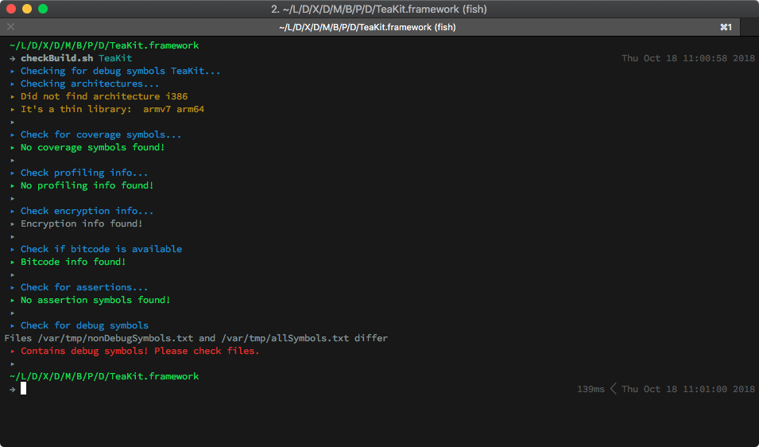

# dev 🤓

Contains some hopefully helpful scripts for development.

- [Usage](#usage)
- [checkBuild](#checkbuild)
- [checkCoverage](#checkcoverage)
- [checkForFlaggedTests](#checkforflaggedtests)

## Usage

To make use of these scripts you can clone this repository to your preferred location like:

    git clone https://github.com/tweetjay/dev.git

and add the path to your shell `PATH` environment variable.

For the 🦄 `fish`-shell this would look like:

    set -g fish_user_paths $fish_user_paths "$HOME/.dev"

Afterwards you should be able to call the script from every place, e.g.:

    $: checkDebug.sh <library>

## checkBuild 🚧

This script is currently intended to be used with libraries build for iOS. It can be used to check iOS build artifacts for various unwanted stuff.

The following functions will check:

- `__check_architectures`: if the artifact contains only the valid architectures
- `__check_coverage_symbols`: if the artifact contains code coverage symbols
- `__check_profiling_data`: if the artifact contains profiling symbols
- `__check_encryption`: if encryption information is present
- `__check_bitcode_availability`: if bitcode is enabled
- `__check_for_assertion`: if the artifact contains assertion symbols
- `__check_debug_symbols`: if the artifact contains debug symbols

The script takes one parameter which is the path to the artifact to check:

    $: checkDebug.sh <library>

If you check a build artifact with this script it will look like:

## checkCoverage

This script is intended to be used for Xcode schemes which will be build and calls xcrun to view the coverage reports.

## checkForFlaggedTests

This script is intended to be used with Swift or Objective C written tests. It
should be called in the folder where the tests are placed or at least in the
project folder.

It will search all `.swift` and `.m` files for patterns like `fit()`

### Requirements

- This script needs the famous [silver searcher](https://github.com/ggreer/the_silver_searcher)
